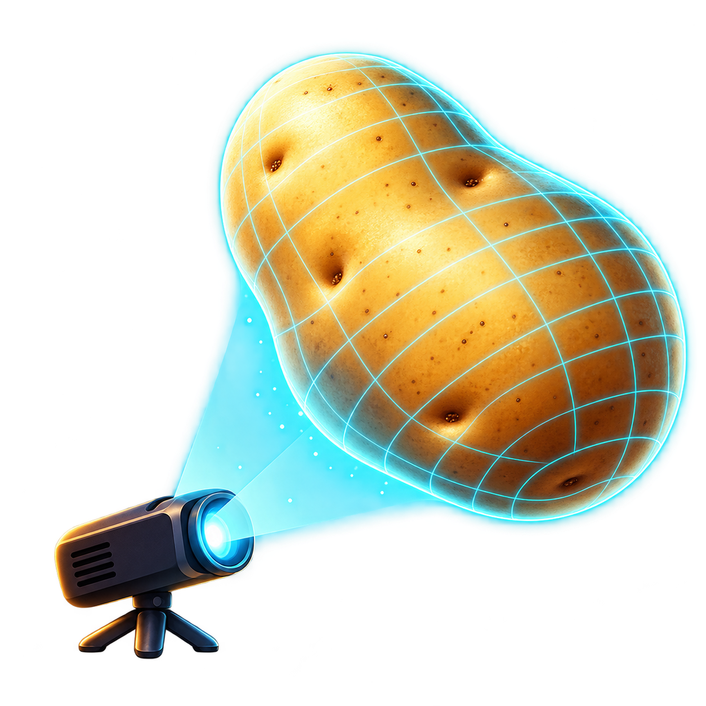

<p align="center"></p>

# Potato Mapper

A small Windows projection mapper for one projector. Put images, videos, or built-in animations on a surface, drag its corners or mesh points into place, and send clean output to your projector. No watermark.

## Download and run

**[Download Potato Mapper for Windows x64](https://github.com/TheGamingDonKey/potato-mapper/releases/download/v0.8.5/PotatoMapper-0.8.5-windows-x64.zip)**

1. Download the app ZIP above, right-click it, and choose **Extract All**.
2. Open the extracted folder and double-click **PotatoMapper.exe**.
3. Keep `PotatoMapper.exe`, `installation.txt`, `current.txt`, and the `versions` folder together.

No installation, Visual Studio, Qt setup, or GitHub account is required. This build targets **64-bit Intel/AMD Windows 10 (22H2) or Windows 11**, with an **OpenGL 3.3 Core** graphics driver. It has been checked locally on Windows 11; testing on other computers is still limited. It is not a macOS or Linux build.

Use the app ZIP under [Releases](https://github.com/TheGamingDonKey/potato-mapper/releases). GitHub's **Code → Download ZIP** and **Source code** downloads contain programming files, not the ready-to-run app. The other release archives provide library source code for developers; you only need the Windows app ZIP to run it.

## Why it exists

Because MadMapper's demo watermark pissed me off.

I wanted to plug in my projector at home, map a few squares onto a wall or an object, and drop media onto them. That became Potato Mapper: a working starting point we can keep improving with developers and AI coding tools.

This is an independent project, unaffiliated with MadMapper. It currently focuses on manual mapping for one projector.

## What works today

- Multiple surfaces with draggable corners and a subdivided mesh.
- Images and looping video, with stretch, fit, and crop options.
- Transparent white alignment grids.
- Potato FX: thirteen animations, including flowing SquareWave cells, Diagonals, CubicCircles and SquareArray. Speed, size/line width, density, colour, angle, reverse and optional soft edges; Flow adds variation to the flowing effects. Waterlight, Contour Flow, Curve Maze and Depth Tunnel ship in v0.7.0. **Hex Tide**, added in v0.8.0, makes small hexagons breathe in coordinated travelling waves.
- Surface ordering, duplication, visibility, position locking, undo, and redo.
- Save/open `.pmap` projects; earlier `.hmap` files still load.
- Separate fullscreen projector output, display selection, and blackout.
- **Potato Scan:** an eight-second entrance that traces the mapped edges, assembles a scan grid, locks the panels and smoothly reveals their media or FX. Replay and Skip controls, with an optional entrance on output start.
- Right-click a surface to load/clear media or rename it. Clearing keeps the mesh and supports Undo.
- Branded startup splash, surface content labels, File/Edit/Help menus, and an About/version display.
- Resizable sidebar, persistent surface list, collapsible settings, themed scrollbars and full-path filename tooltips.
- Per-surface brightness and opacity, with live preview, one Undo per slider drag and saved settings. Older mappings default to 100%.
- **Appearance → Blend:** Normal, Screen and Add for layering images, video and patterns. Screen/Add let suitable black-background media reveal the surfaces below.
- **Help → Check for updates** downloads and installs newer stable Windows releases, then reopens your saved mapping. The previous app version is retained for recovery.

Early prototype: expect rough edges. It has been run on Windows 11 with an AMD Radeon 840M. Automated checks cover animated editor/output rendering, pause, and saved pattern settings. A user has tried the basic mapping workflow; broad hardware and projector compatibility has not been established.

## Build on Windows

Install:

1. **Visual Studio 2022 or Build Tools 2022**, with **Desktop development with C++** and a Windows SDK.
2. **Qt 6.10 or later**, the **MSVC 2022 64-bit** build, including **Qt Multimedia**. The working development setup uses Qt **6.10.3**.
3. **CMake 3.24 or later**.

Clone this repository and run in PowerShell, substituting your Qt installation path:

```powershell
.\build.ps1 -QtPath 'C:\Qt\6.10.3\msvc2022_64'
# Open PotatoMapper.exe at the "Ready to run" path printed by the script.
```

The script builds Release and deploys a fresh runnable folder under `out/dev-app-<timestamp>`. Existing app folders and personal files are preserved. Use `-AppDirectory` to choose a new destination; it must not already exist. It also accepts `-CMakePath` and `-BuildDirectory` overrides. `QT_ROOT_DIR` or `QTDIR` can supply the Qt path. The original development machine's cached tools remain a fallback.

No Qt libraries, media files, or compiled binaries are committed to the source tree. Ready-to-run binaries and library sources are distributed through GitHub Releases.

To create a portable ZIP after building, run `./package.ps1 -QtPath 'C:\Qt\6.10.3\msvc2022_64'`. Pass the same `-BuildDirectory` if you overrode it during the build. The packager finds the installed Visual C++ x64 redistributable DLLs, deploys Qt into a fresh folder, and includes the runtime notices. Output goes under `out/releases`. The current notices and source archives correspond to Qt 6.10.3 and FFmpeg 7.1.3; update them when upgrading dependencies.

## Use it

1. Connect your projector and choose **Windows + P → Extend**.
2. Add a surface. Drop an image/video onto it, use **Load media**, or open **Potato FX** and choose an animation.
3. Drag corner handles; switch **Edit** to **Mesh points** for finer adjustments. Drag inside a surface to move it.
4. Choose the projector under **PROJECTOR OUTPUT** and click **Start output**.
5. Use **Stop**, or Escape while the output window has focus. **B** toggles blackout while a mapper window has focus.
6. Save your mapping. **Projects** in the app folder is the default location. Media stays linked; opening a project collects a portable copy with its referenced media when those files are available.

Mouse wheel zooms the editor; middle-drag pans. Arrow keys nudge the selected handle/surface; Shift increases the step. Dropping media on an animation surface switches it back to media playback. **Clear media** returns an image, video, or animation surface to the white grid. Double-click a surface's list entry to rename it.

Drag the divider beside the surface list to resize the sidebar. Click **Media**, **Appearance**, **Potato FX** or **Mapping** headings to expand/collapse their controls. Appearance sliders dim/fade the selected surface; **Reset appearance** restores both to 100% and Blend to Normal. Screen gives a softer bright overlay; Add adds light and can clip to white. Move the overlay above the other surface using **Forward**, overlap their mapped areas, then choose Screen/Add. Open Potato FX and choose a flowing effect. Start with White, Soft edge 0%, Speed 100% and Flow 70%. Increase Density for smaller elements, then adjust Cell size or Line width. SquareWave uses dense stretching cells; Diagonals uses rotating strokes; CubicCircles morphs filled cells into circles/rings; SquareArray moves rows of changing blocks. Waterlight draws a shimmering light web; Contour Flow drifts landscape-like lines; Curve Maze joins curved paths; Depth Tunnel creates a perspective grid. Older dots, stripes, rings and the former square waves (now labelled Stepped waves) remain available. Earlier app versions ignore the new appearance settings and do not retain them when saving.

### Potato Scan entrance

Shipped in [0.8.4](https://github.com/TheGamingDonKey/potato-mapper/releases/tag/v0.8.4).

Under **PROJECTOR OUTPUT**, click **Play entrance** to preview or replay Potato Scan across your visible mapped surfaces. **On output start** is enabled by default; clear it if Start output should immediately show your normal projection. **Skip** restores the projection immediately. Blackout hides the scan and pauses its clock; Stop or Escape ends it. Opening a different project also ends it.

Starting an entrance turns blackout off automatically, so **Play entrance** can reveal the scan in one click. You can still switch blackout on during the entrance to pause it. With **On output start** disabled, Start output retains your blackout setting.

The scan follows your actual corners and mesh deformation. It is a theatrical entrance using the mappings you already made; it does not use a camera or recognize walls. Your media, individual FX and Dynamic FX remain assigned, and the entrance does not edit the saved project. Animation clocks continue behind the entrance so the revealed content is current.

### Dynamic FX

**Shipped in [0.8.1](https://github.com/TheGamingDonKey/potato-mapper/releases/tag/v0.8.1).** Open **File → Examples** for a three-surface demo, or click **Dynamic FX** and choose participating surfaces. **Hot-Ass Potato** explores their perimeters with a polygon snake, sheds fragments, performs a staged glitch/reboot, then settles into coordinated ambient geometry. **Potato Focus** adds holographic scanning bands and polygon networks. Speed, shape count, six colours and pause apply to the whole group; Replay intro and Skip to ambient control the snake sequence. Switch the effect to Off to restore the surfaces' original media or individual FX.

[0.8.2](https://github.com/TheGamingDonKey/potato-mapper/releases/tag/v0.8.2) reduces geometry preparation work, shares it between editor and projector, and reuses geometry and GPU buffers while paused. The animation look is retained; performance still depends on hardware and mesh complexity.

These effects use the mapped mesh and one shared clock for editor/projector. The snake visits nearby surfaces and uses the centre of their widest facing overlap, with its tail continuing across the handoff. Overlapping panels can share one crossing point. With no facing opening it falls back to the closest boundary; separate gaps stay dark. Routing uses the corner/projective outline, so heavily deformed outer mesh edges remain approximate. Cameras and automatic physical-surface recognition remain future work.

## Updating an existing copy

**From v0.2.0:** close the old app, extract the new ZIP, then copy the new package's contents into your existing app folder. Replace `PotatoMapper.exe` when asked and keep your mapping files and media. This one-time upgrade adds the launcher. You can also extract into a fresh folder and open existing mappings from there.

**From v0.3.0 onward:** use **Help → Check for updates**. Downloads show progress and can be cancelled. Before restarting, the app asks you to save/discard/cancel unsaved changes and stop any active projection. Your saved mapping reopens after installation. **Help → Use previous app version** switches back to the retained version; it does not undo edits to saved projects.

If an older copy says it was opened outside the portable launcher layout, save and close it, then open **PotatoMapper.exe in the main extracted folder** and check again. A shortcut should point to that file. Only extract another full app ZIP if the launcher files are missing. From v0.7.1, directly opening the inner editor also detects its enclosing portable folder.

Save personal files outside `versions`, `.updates` and `.maintenance`, which are managed app folders. The root launcher selects the current editor in `versions`; its name and your outer folder can remain **Potato Mapper** through updates. Updates require an internet connection and a writable app folder; mapping still works offline. There is no automatic update check during projection.

The 0.8.1 maintenance payload can refresh an older root launcher automatically and retains its previous executable under `.maintenance`. The launcher repairs a missing/invalid current pointer using a complete retained version; new runtimes also retain an inventory so a damaged selected runtime can fall back. A completely deleted launcher still needs a replacement from a full release ZIP. Keep the existing Projects folder and media when repairing an installation.

On normal startup, mappings immediately inside the app root or a version folder are copied with available media into **Projects**; originals stay in place. Opening an external mapping uses the same collection process. Edited managed copies are retained, collisions get separate names, and **File → Recent projects / Open Projects folder** make them accessible. Saves keep the previous mapping beside it as `.bak`. New media added later remains linked until the mapping is opened and collected again. Keep a separate backup of Projects: deleting the entire app folder also deletes projects stored there.

## Continue development

See the [roadmap checklist](ROADMAP.md) for completed features, sensible next steps, and where development stopped. Read [DEVELOPMENT.md](DEVELOPMENT.md) for the architecture and focused checks. [AGENTS.md](AGENTS.md) gives coding agents the same working conventions.

## License

[MIT](LICENSE). You can use, modify, and redistribute the project under those terms.

The potato logo was generated with AI. Bundled Qt, FFmpeg, and Microsoft runtime libraries have their own terms; see [runtime notices](packaging/THIRD-PARTY.txt). Library sources accompany the binary release.
